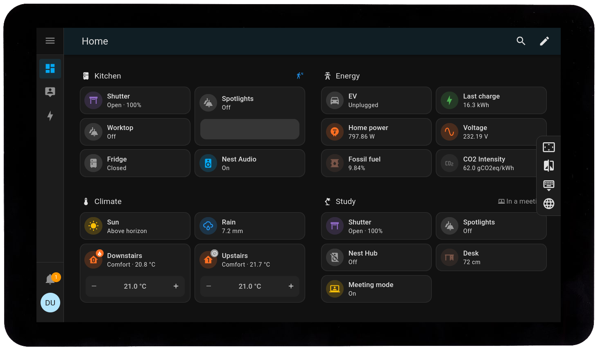
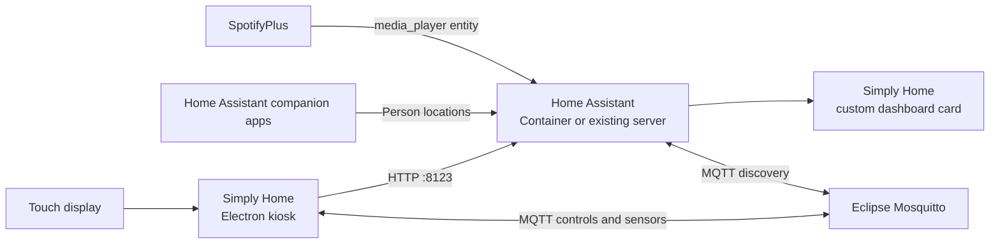

# Simply Home

<p align="center">
  
</p>

<p align="center">
  A touch-first Home Assistant kiosk and custom wall-panel dashboard for Linux displays and Raspberry Pi.
</p>

[](https://github.com/dushyantgithub/simply-home/actions)
[](https://github.com/dushyantgithub/simply-home/releases)
[](https://github.com/dushyantgithub/simply-home/releases)
[](LICENSE)

Simply Home combines two pieces:

1. An Electron kiosk that keeps Home Assistant open on a dedicated Linux touchscreen, remembers the login, starts with the desktop session, and exposes optional panel controls through MQTT.
2. A compact Home Assistant custom card designed for a 480 × 800 portrait wall panel, with home, device, security, weather, people-map, SpotifyPlus, and native Settings access.



## What it includes

### Kiosk application

- Fullscreen, touch-oriented Home Assistant webview
- Multiple page URLs with touch navigation and browser history
- Theme and zoom controls
- Optional on-screen keyboard integration
- Display wake, power, and brightness controls where supported
- MQTT discovery for panel controls and diagnostics
- Network, CPU, memory, temperature, audio, and uptime sensors
- Remote refresh, screenshot, reboot, shutdown, and page switching
- Debian packages for arm64 and x64, plus portable zip builds

### Simply Home dashboard

- Purpose-built Home, Devices, and Security screens
- Native Home Assistant Settings instead of a duplicate kiosk settings page
- Dynamic Home Assistant user count
- Home Assistant people map using available `person.*` entities
- Hourly and daily weather forecasts
- SpotifyPlus media-player discovery and playback controls
- Light and dark dashboard modes
- Optional automation that uses dark mode during the day and light mode at night
- A low-distraction night/away screen that shows the signed-in Home Assistant user

See [HARDWARE.md](HARDWARE.md) for platform-specific capabilities and limitations.

## Architecture



Home Assistant and Mosquitto may run on the same Raspberry Pi as the kiosk or on another computer on the local network.

## Requirements

- A 64-bit Debian-based Linux desktop, such as Raspberry Pi OS Desktop or Ubuntu
- A working graphical session using Wayland or X11
- Home Assistant reachable over HTTP or HTTPS
- Node.js 22 and Yarn Classic for source development
- Docker Engine and Docker Compose only if this device will also host Home Assistant
- An MQTT broker only if remote panel controls and diagnostics are wanted

Use a dedicated, non-administrator Home Assistant user for a permanently mounted panel. Never commit `.env`, Home Assistant secrets, MQTT passwords, or Electron browser data.

## Quick start

### 1. Install the kiosk

On the Linux panel, run this as the normal desktop user, not as root:

```bash
bash <(wget -qO- https://raw.githubusercontent.com/dushyantgithub/simply-home/main/install.sh)
```

The installer downloads the correct release, installs it, creates `simply-home.service`, enables startup, and opens first-run setup.

For a panel that hosts Home Assistant locally, use:

- Web URL: `http://127.0.0.1:8123/wall-panel/homepage?kiosk`
- Theme: `dark`
- Zoom: `1.0`
- Widget: `true`

For Home Assistant on another device, replace `127.0.0.1` with its hostname, LAN IP, or HTTPS address.

Useful service commands:

```bash
systemctl --user status simply-home.service
systemctl --user restart simply-home.service
systemctl --user stop simply-home.service
```

Run setup again at any time:

```bash
simply-home --setup
```

Application settings, browser data, and logs are stored under `~/.config/simply-home/`.

### 2. Sign in to Home Assistant

When Home Assistant opens on the panel:

1. Enter the actual URL of the Home Assistant instance when My Home Assistant asks for it. A typical local URL is `http://homeassistant.local:8123`; this project uses `http://127.0.0.1:8123` when Home Assistant runs on the same Pi.
2. Sign in with the dedicated panel user.
3. Choose to stay signed in.
4. Open the wall-panel dashboard after it has been created in the next section.

### 3. Install the custom dashboard card

Copy the card into Home Assistant's `www` directory:

```bash
mkdir -p /path/to/home-assistant/config/www/community/simply-home-dashboard
cp js/lovelace/simply-home-dashboard.js \
  /path/to/home-assistant/config/www/community/simply-home-dashboard/simply-home-dashboard.js
```

In Home Assistant, open **Settings → Dashboards → Resources** and add:

```text
/local/community/simply-home-dashboard/simply-home-dashboard.js
```

Choose **JavaScript module** as the resource type. If the resource is updated later, add or increment a query version such as `?v=2`, then reload the kiosk to bypass an old browser cache.

Create a dashboard whose URL path is `wall-panel`, then add these panel views in the dashboard's raw configuration editor:

```yaml
views:
  - title: Home
    path: homepage
    type: panel
    cards:
      - type: custom:simply-home-dashboard
        screen: home

  - title: Devices
    path: devices
    type: panel
    cards:
      - type: custom:simply-home-dashboard
        screen: devices

  - title: Security
    path: security
    type: panel
    cards:
      - type: custom:simply-home-dashboard
        screen: security
```

The dashboard's Settings button performs a full navigation to Home Assistant's native `/config` page. This intentionally avoids keeping wall-panel kiosk styling active while the much larger Settings interface loads.

### 4. Match your Home Assistant entities

The dashboard was built for a real Home Assistant installation and contains several installation-specific entity IDs. Review the constants near the top of [`js/lovelace/simply-home-dashboard.js`](js/lovelace/simply-home-dashboard.js) before using it elsewhere.

The most important assumptions are:

| Feature          | Expected entity or behavior                                                          |
| ---------------- | ------------------------------------------------------------------------------------ |
| Weather          | `weather.forecast_home`                                                              |
| People map       | Every available `person.*` entity with latitude and longitude                        |
| Signed-in name   | Current Home Assistant user's display name                                           |
| User count       | Home Assistant authentication user list; requires an account allowed to read it      |
| Spotify          | First `media_player.*` entity whose ID or friendly name contains SpotifyPlus/Spotify |
| Security camera  | `camera.home_360` and its related switches/select                                    |
| Lights and power | Entity IDs listed in `LIGHT_ENTITIES`, `ALL_CONTROLLABLE`, and `ROOM_DATA`           |

Rename those references in the card or align the Home Assistant entity IDs with the installation. Unavailable entities are displayed gracefully, but their controls cannot work until the IDs match.

### 5. Add the light/dark theme helper and automation

The optional package at [`deploy/home-assistant/examples/simply-home-theme-package.yaml`](deploy/home-assistant/examples/simply-home-theme-package.yaml) creates:

- `input_select.simply_home_theme`, a manual **Light/Dark** switch under Home Assistant Helpers
- An automation that selects **Dark** while `sun.sun` is above the horizon and **Light** while it is below the horizon

To use Home Assistant packages, add this to `configuration.yaml` if packages are not already enabled:

```yaml
homeassistant:
  packages: !include_dir_named packages
```

Then copy the example and restart Home Assistant after checking the configuration:

```bash
mkdir -p /path/to/home-assistant/config/packages
cp deploy/home-assistant/examples/simply-home-theme-package.yaml \
  /path/to/home-assistant/config/packages/simply-home-theme.yaml
```

For Home Assistant Container, check the configuration with:

```bash
docker exec homeassistant python -m homeassistant --script check_config --config /config
```

The card also falls back to the `sun.sun` state when the helper has not been installed.

## Raspberry Pi: server and panel on one device

Do not install Home Assistant OS when the same Raspberry Pi must also run this desktop kiosk. Home Assistant OS is an appliance image and does not provide the regular Raspberry Pi desktop session required by Electron.

Use this layout instead:

1. Raspberry Pi OS 64-bit Desktop supplies the touchscreen and Wayland desktop.
2. Home Assistant Container runs locally with Docker.
3. Mosquitto runs beside Home Assistant for optional panel controls.
4. Simply Home opens `http://127.0.0.1:8123` in the local desktop session.

The complete walkthrough is in [docs/RASPBERRY_PI.md](docs/RASPBERRY_PI.md). A Docker Compose stack is included under [`deploy/home-assistant`](deploy/home-assistant).

Start the stack with:

```bash
cd deploy/home-assistant
cp .env.example .env
# Edit .env before continuing.
docker compose up -d
```

Home Assistant Container does not include the Supervisor or managed add-ons. Run required supporting services as separate containers.

## Command-line configuration

### Web options

| Argument       | Default  | Purpose                                      |
| -------------- | -------- | -------------------------------------------- |
| `--web-url`    | required | One URL, or comma-separated URLs, to display |
| `--web-theme`  | `dark`   | Electron UI theme: `light` or `dark`         |
| `--web-zoom`   | `1.25`   | Browser zoom; `1.0` is 100%                  |
| `--web-widget` | `true`   | Show or hide the side control widget         |

Example:

```bash
simply-home --web-url=http://127.0.0.1:8123/wall-panel/homepage?kiosk \
  --web-theme=dark \
  --web-zoom=1.0
```

### MQTT options

| Argument           | Default         | Purpose                                    |
| ------------------ | --------------- | ------------------------------------------ |
| `--mqtt-url`       | unset           | Broker URL such as `mqtt://127.0.0.1:1883` |
| `--mqtt-user`      | unset           | Dedicated broker username                  |
| `--mqtt-password`  | unset           | Dedicated broker password                  |
| `--mqtt-discovery` | `homeassistant` | Home Assistant discovery prefix            |

Example:

```bash
simply-home \
  --web-url=http://127.0.0.1:8123/wall-panel/homepage?kiosk \
  --mqtt-url=mqtt://127.0.0.1:1883 \
  --mqtt-user=kiosk
```

Avoid entering the MQTT password directly in a shell command because it may be saved in shell history. Use `simply-home --setup` instead. The saved argument file must still be treated as sensitive.

## Keyboard shortcuts

| Shortcut                                   | Action                          |
| ------------------------------------------ | ------------------------------- |
| `Control+Left` / `Control+Right`           | Previous / next configured page |
| `Control+Num_Subtract` / `Control+Num_Add` | Decrease / increase zoom        |
| `Alt+Left` / `Alt+Right`                   | Back / forward in web history   |

## Project structure

| Path                                   | Purpose                                                             |
| -------------------------------------- | ------------------------------------------------------------------- |
| `index.js`                             | Electron application entry point and process lifecycle              |
| `js/webview.js`                        | Home Assistant webview, kiosk behavior, navigation, theme, and zoom |
| `js/hardware.js`                       | Linux/Raspberry Pi display and hardware integration                 |
| `js/integration.js`                    | MQTT discovery, commands, and diagnostics                           |
| `js/lovelace/simply-home-dashboard.js` | Custom Home Assistant wall-panel card                               |
| `html/`                                | Loader, widget, navigation, and status UI                           |
| `deploy/home-assistant/`               | Docker Compose deployment for Home Assistant and Mosquitto          |
| `docs/RASPBERRY_PI.md`                 | End-to-end Raspberry Pi installation guide                          |
| `HARDWARE.md`                          | Supported hardware controls and platform notes                      |

## Development

```bash
git clone https://github.com/dushyantgithub/simply-home.git
cd simply-home
yarn install --frozen-lockfile
yarn start
```

Build distributable packages with:

```bash
yarn build
```

Run formatting checks with:

```bash
yarn format:check
```

When launching from SSH into a Raspberry Pi desktop session, these variables may be required:

```bash
export DISPLAY=:0
export WAYLAND_DISPLAY=wayland-0
```

## Updating a live Raspberry Pi

Update the packaged kiosk application with:

```bash
bash <(wget -qO- https://raw.githubusercontent.com/dushyantgithub/simply-home/main/install.sh) update
```

After replacing the custom dashboard JavaScript, increment its resource query version and restart the kiosk:

```bash
systemctl --user restart simply-home.service
```

## Troubleshooting

- Kiosk status: `systemctl --user status simply-home.service`
- Application log: `~/.config/simply-home/logs/main.log`
- Live service log: `journalctl --user -u simply-home.service -f`
- Electron logging: start with `simply-home --enable-logging`
- Webview developer tools: start with `simply-home --app-debug`
- GPU rendering trouble: test `simply-home --disable-gpu`
- Home Assistant containers: `docker compose ps` and `docker compose logs -f`
- Stale dashboard after an update: increment the resource `?v=` value and restart the kiosk
- Settings appears stuck: confirm the dashboard resource is current and that Settings is rendered as a native link to `/config`

Open an issue with the Simply Home version, Linux/Raspberry Pi OS version, display server, screen model, Home Assistant version, and the relevant log excerpt.

## References and acknowledgements

Simply Home builds on these projects and their documentation:

- [Home Assistant](https://www.home-assistant.io/) and its [dashboard documentation](https://www.home-assistant.io/dashboards/)
- [Home Assistant Container installation](https://www.home-assistant.io/installation/linux)
- [Home Assistant custom-card developer guide](https://developers.home-assistant.io/docs/frontend/custom-ui/custom-card/)
- [Home Assistant Map card](https://www.home-assistant.io/dashboards/map/), used to render people with location coordinates
- [Home Assistant MQTT integration and discovery](https://www.home-assistant.io/integrations/mqtt/)
- [Electron](https://www.electronjs.org/docs/latest/), used for the Linux kiosk application
- [Eclipse Mosquitto](https://mosquitto.org/documentation/), used as the optional MQTT broker in the bundled Compose stack
- [SpotifyPlus for Home Assistant](https://github.com/thlucas1/homeassistantcomponent_spotifyplus), supported by the dashboard's media controls
- [Material Design Icons](https://pictogrammers.com/library/mdi/), referenced through Home Assistant's `mdi:` icon system

This project is not affiliated with or endorsed by Home Assistant, Nabu Casa, Spotify, Raspberry Pi, Electron, or Eclipse Mosquitto. Their names and trademarks belong to their respective owners.

## License

MIT. See [LICENSE](LICENSE). The retained copyright notice in that file is required for redistribution of the inherited MIT-licensed portions.
